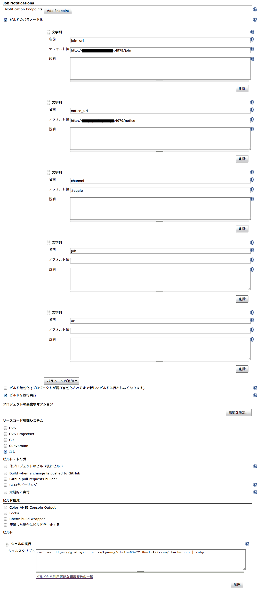
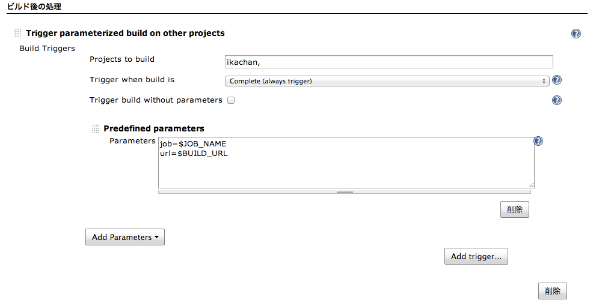

# Jenkins Ikachan

Jenkins build result notification with ikachan

## Requirement

* Ruby

## Feature

* Colorize IRC output

## Setup

* Create new free-style job on Jenkins
* Parameterized build setting ([fig.1](#fig1))
  * `join_url` is ikachan join url
  * `notice_url` is ikachan notice url
  * `channel` is irc channel
  * `job` is $JOB_URL of parent job (make to pass through from parent job)
  * `url` is $BUILD_URL of parent job (make to pass through from parent job)
* Build: run shell script

```
curl -s https://raw.github.com/kyanny/jenkins-ikachan/v1.0/ikachan.rb | ruby
```

* Invoke from other jobs with parameters ([fig.2](#fig2))
  * Choose `Complete (always trigger)`

```
job=$JOB_NAME
url=$BUILD_URL
```

---

### fig.1



---

### fig.2


